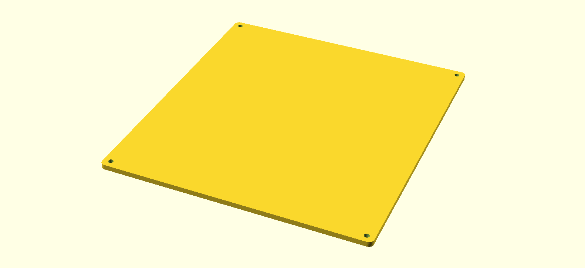

# An enclosure for a lab-bench PSU

## Context

The goal of this project was to make an enclosure for my lab-bench power supply, made of an old ATX power supply.

The problem was that the existing case was made of metal and too small for the additional hardware. This lead to short circuits sometimes.

## Design

__The box ([`box.scad`](box.scad))__:

__The cover ([`cover.scad`](cover.scad))__:

__Final dimensions ([`common.scad`](common.scad))__:

The final dimensions of both the cover and the box are
defined in `common.scad`.

## 3D Printing

I printed both parts using [a custom Slic3r config](slic3r-config.ini):

- Layer height: 0.2
- Vertical Shells / Perimeter: 5
- Infill: 100%
- No support material

## Bill of Material

- ~250g PLA filament
- 6x DANIU 4mm Terminal Banana Plug Socket Jack Connectors
- 3x Geekcreit® 0.28 Inch 2.5V-30V Mini Digital Volt Meter
- 2x 5mm LED
- 4x M3 screw
- an old ATX power supply

## Remaining work

The alveolus vents pattern is maybe a bit to thin/fragile.
If I need to reprint it, I would increase the `vent_margin` in `common.scad`
to something like 2 mm and maybe `vent_alveolus_size` to 8 mm.
